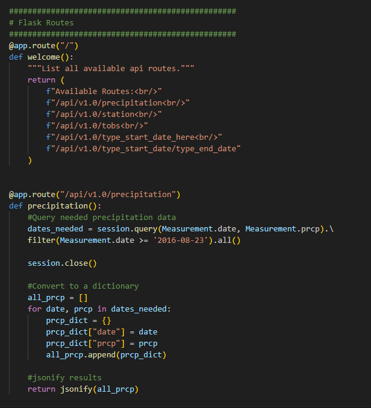

# Honolulu Climate Analysis with SQL-Alchemy and Flask

# Summary:

This project involves conducting a climate analysis for a vacation in Honolulu, Hawaii, using Python, SQLAlchemy, and Flask. The analysis includes exploring climate data, performing precipitation and station analyses, designing a Flask API to access the data, and creating static and dynamic routes to retrieve relevant information about weather conditions. Finally, the project follows coding conventions and formatting guidelines, including thorough commenting, for clarity and maintainability.

# Precipitation Results:
The image below shows a plot of the last 12 months of precipitation data for Hawaii. 

# Weather Station Results:

This shows the last 12 months of temperature observation data for the most active weather station in Hawaii.

# Sample Flask Code:

# File Information:
SurfsUp contains all of the solution files for this challenge. 

climate_starter is the solution file for the climate and station analysis. 

App is the solution file for the Flask climate app. 

Resources contains the resources files. 
